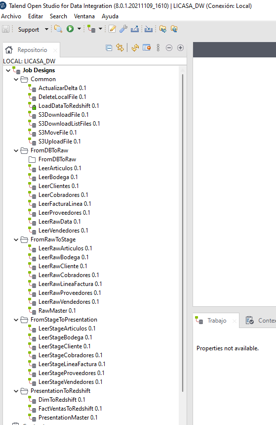

# **Construcción de solución**

## **Estructura de Jobs utilizados**
En el software Talend Open Studio se diseño  la siguiente estructura para la gestión de los Jobs que se utilizan en cada una de las zonas involucradas en el proceso de construcción de Data Warehouse.

## **Estructura de Jobs**
1. [Jobs Common](JobCommon.md)

2. [Jobs FromDBToRaw](FromDBToRaw.md)

3. [Jobs FromRawToStage](FromRawToStage.md)

4. [Jobs FromStageToPresentation](FromStageToPPT.md)

5. [Jobs FromPresentationToRedshift](FromPresentationToRedshift.md)

---
[Anterior](HerramientasUtilizadas.md)

[Siguiente](Resultados.md)

[Regresar a pagina principal](../README.md)