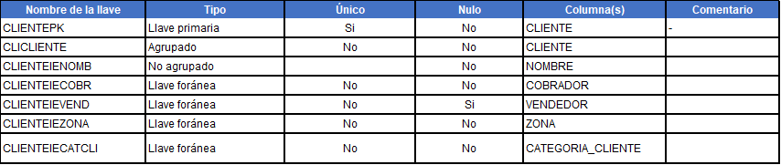

# **Descripción del Data Set y diccionario de datos**

Para la solución del proceso de ventas de la empresa se han identificado un conjunto de tablas del sistema transaccional que serán utilizadas como fuente de datos para el Data Warehouse, estas tablas serán conocidas como el ‘Data Set’, todas las tablas pertenecen al mismo esquema de la base de datos (SQL Server). Esquema: LICASA. Las tablas identificadas son las siguientes:

---
### **1. Artículo**
Almacena los productos que la empresa utiliza para su proceso de ventas y para uso interno de sus operaciones.

**Indices**

**Referencias:**

LICASA.CLASIFICACION (CLASIFICACION_1 => CLASIFICACION)

LICASA.CLASIFICACION (CLASIFICACION_2 => CLASIFICACION)

LICASA.CLASIFICACION (CLASIFICACION_3 => CLASIFICACION)

LICASA.PROVEEDOR (PROVEEDOR)

**Referenciada por:**

LICASA.FACTURA_LINEA (ARTICULO)

---
### **2. Clasificación**
Guarda los valores del catálogo que se utiliza para clasificar los artículos de la empresa. 

**Indices**

**Referenciada por:**

LICASA.ARTICULO (CLASIFICACION_1 -> CLASIFICACION)

LICASA.ARTICULO (CLASIFICACION_2 -> CLASIFICACION)

LICASA.ARTICULO (CLASIFICACION_3 -> CLASIFICACION)

---
### **3. Cliente**
Almacena a todas las personas naturales y jurídicas que forman parte de la cartera de clientes de la empresa.

**Indices**

**Referencias:**

LICASA.CATEGORIA_CLIENTE (CATEGORIA_CLIENTE)

LICASA.COBRADOR (COBRADOR)

LICASA.VENDEDOR (VENDEDOR)

LICASA.ZONA (ZONA)

**Referenciada por:**

LICASA.FACTURA (CLIENTE)

LICASA.FACTURA (CLIENTE_CORPORAC -> CLIENTE)

---
### **4. Categoria_Cliente**
Almacena el catálogo que se utiliza para categorizar a los clientes.

**Indices**

**Referenciada por:**

LICASA.CLIENTE (CATEGORIA_CLIENTE)

---
### **5. Vendedor**
Guarda todos los vendedores con los que han trabajado en la empresa.

**Indices**

**Referenciada por:**

LICASA.CLIENTE (VENDEDOR)

LICASA.FACTURA (VENDEDOR)

---
### **6. Proveedor**
Almacena todos los proveedores con los que ha trabajado la empresa.

**Indices**

**Referenciada por:**

LICASA.ARTICULO (PROVEEDOR)

---
### **7. Cobrador**
Guarda los datos de los cobradores, internamente conocidos como motoristas, que han trabajado en la empresa.

**Indices**

**Referenciada por:**

LICASA.CLIENTE (COBRADOR)

LICASA.FACTURA (COBRADOR)

---
### **8. Zona**
Almacena el catálogo que permite a la empresa segregar a sus clientes de forma geográfica y/o por la empleada (display) encargada de promocionar sus productos en sus establecimientos.

**Indices**

**Referenciada por:**

LICASA.CLIENTE (ZONA)

LICASA.FACTURA (ZONA)

---
### **9. Bodega**
Guarda los datos de las bodegas utilizadas por la empresa como almacén de sus productos.

**Indices**

**Referenciada por:**

LICASA.FACTURA_LINEA (BODEGA)

---
### **10. Factura**
Guarda los datos relacionados al encabezado de una transacción de venta, también conocida como factura. 

**Indices**

**Referencias:**

LICASA.COBRADOR (COBRADOR)

LICASA.ZONA (ZONA)

LICASA.CLIENTE (CLIENTE)

LICASA.VENDEDOR (VENDEDOR)

---
### **11. Factura_Linea**
Almacena los datos detallados de una transacción de venta, el artículo, cantidades y otros detalles pertinentes a la transacción. 

**Indices**

**Referencias:**

LICASA.ARTICULO (ARTICULO)

LICASA.BODEGA (BODEGA)

LICASA.FACTURA (FACTURA, TIPO_DOCUMENTO)

---

[Anterior](IntroduccionLogicaNegocio.md)

[Siguiente](ResultadosDataProfiling.md)

[Regresar a pagina principal](../README.md)