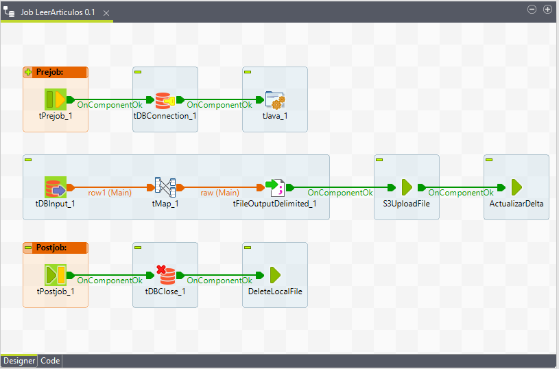
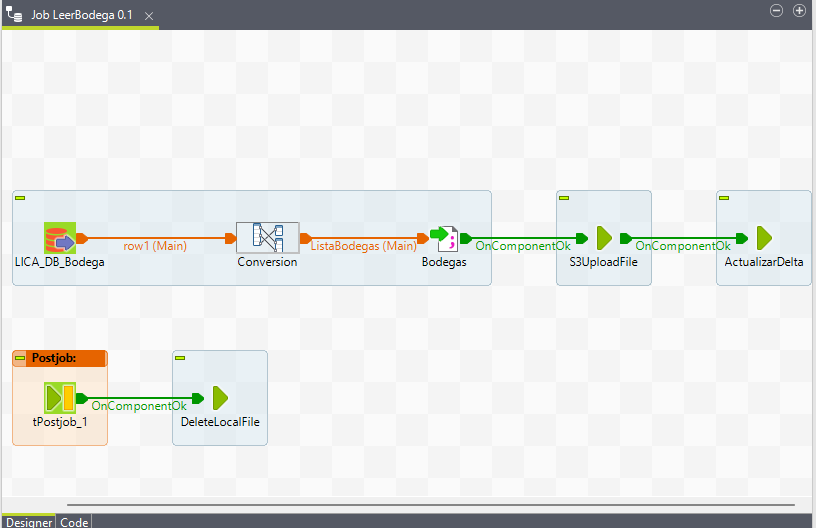
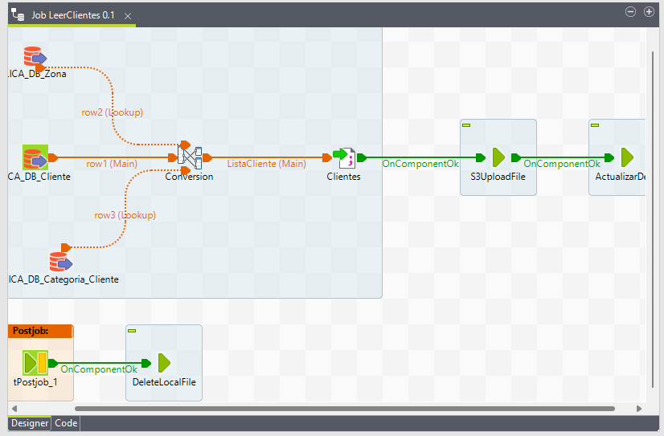
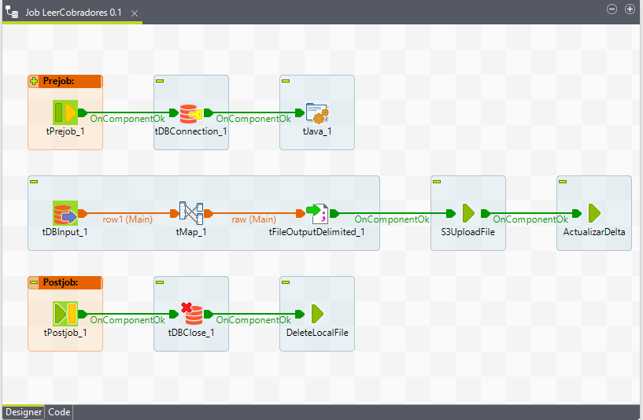
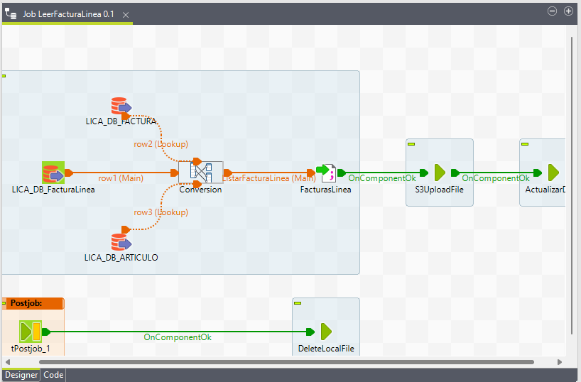
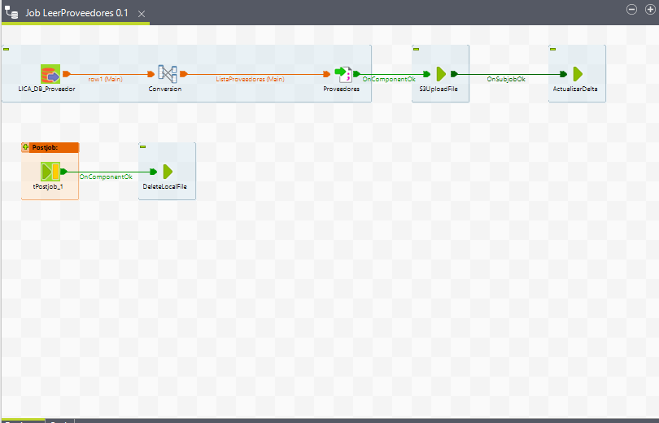
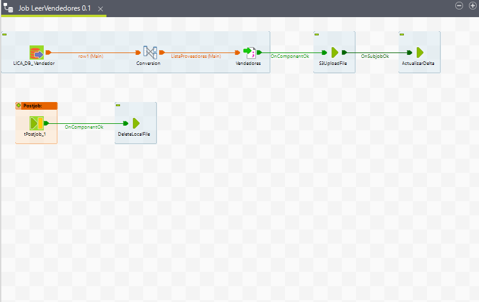
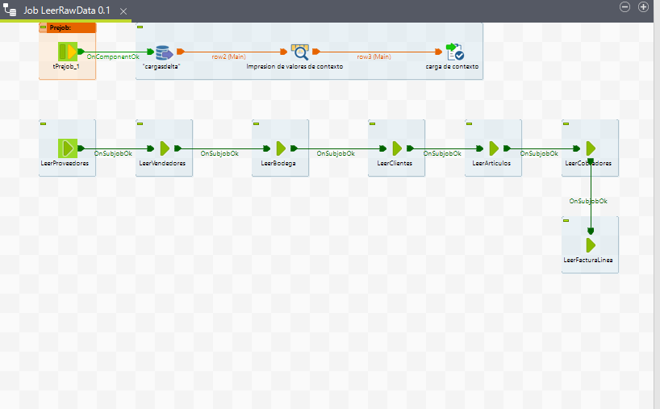

# **Jobs FromDBToRaw**

Son los Jobs que realizan la lectura de los datos crudos desde la base de datos transaccional y colocando los datos corresspondientes en la Zona Raw de Amazon S3 

## **1. Job LeerArticulo**

## **2. Job LeerBodega**

## **3. Job LeerClientes**

## **4. Job LeerCobradores**

## **5. Job LeerFacturaLinea**

## **6. Job LeerProveedores**

## **7. Job LeerVendedores**

## **8. Job LeerRawData**

---
[Anterior](JobCommon.md)

[Siguiente](FromRawToStage.md)

[Regresar a pagina principal](../README.md)