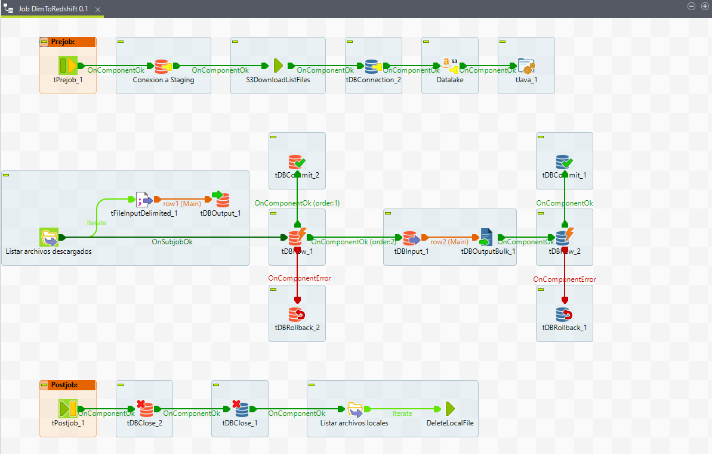
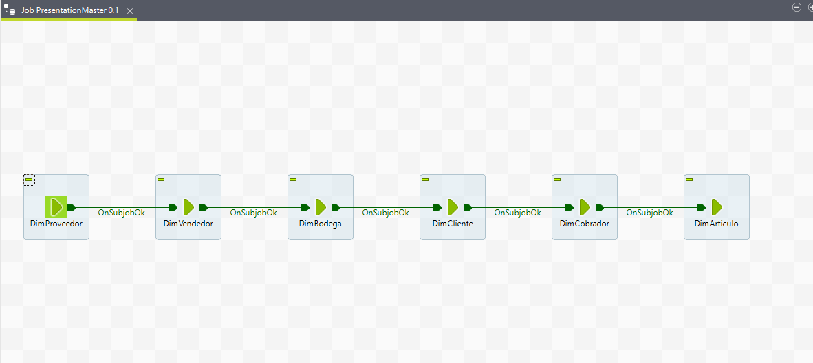

# **Jobs FromPresentationToRedshift**

Son los Jobs que realizan las transformaciones necesarias de los datos pasandolos a la base de datos Amazon Redshift

## **1. Job DimToRedshift**

## **2. Job FactVentasToRedshift**

## **3. Job PresentationMaster**

---
[Anterior](FromStageToPPT.md)

[Regresar a pagina principal](../README.md)