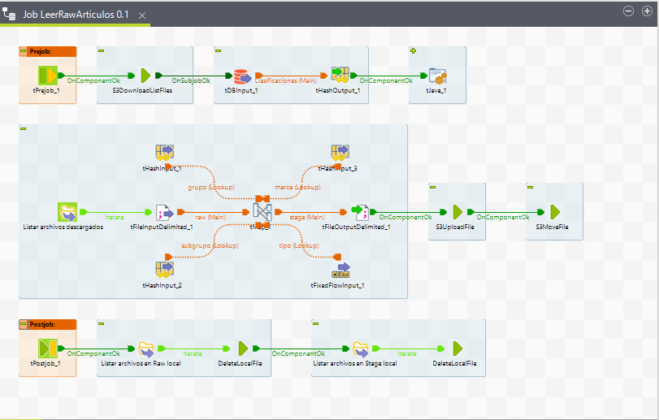
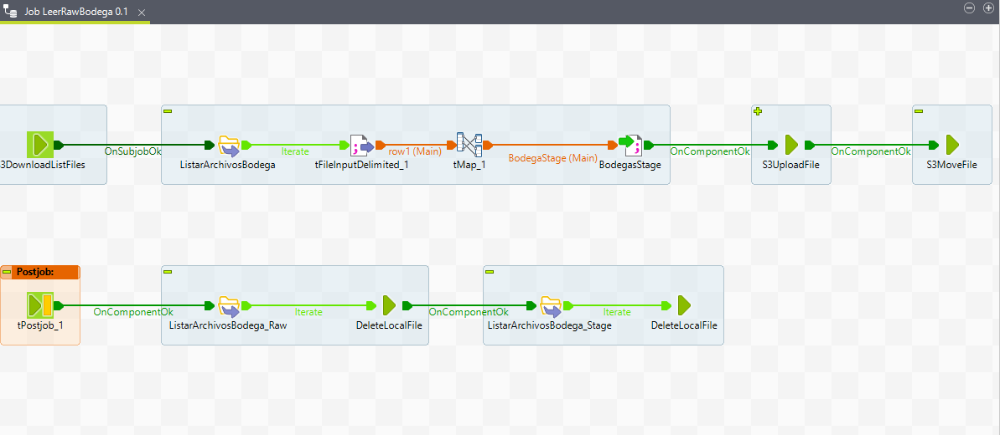
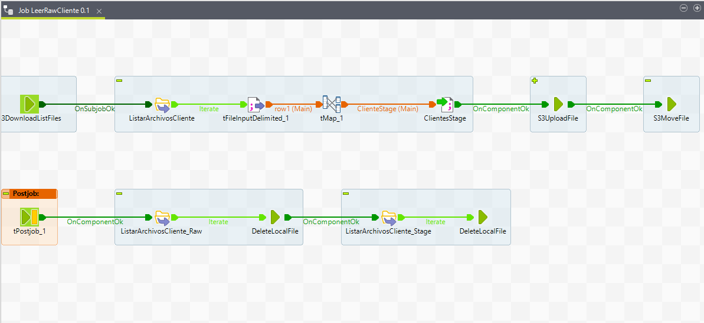
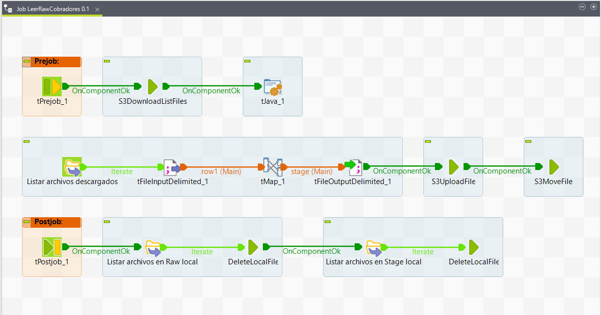
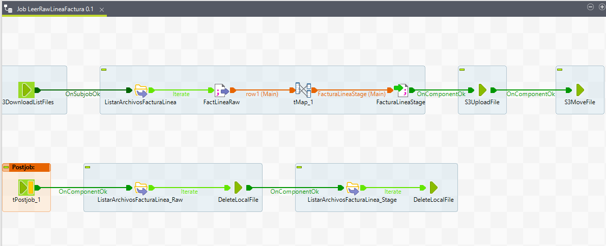
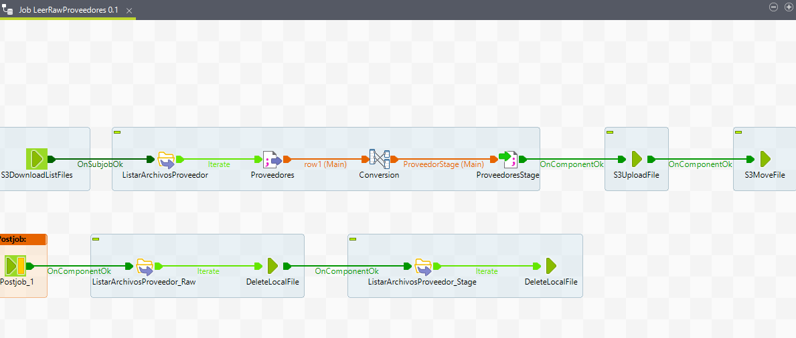
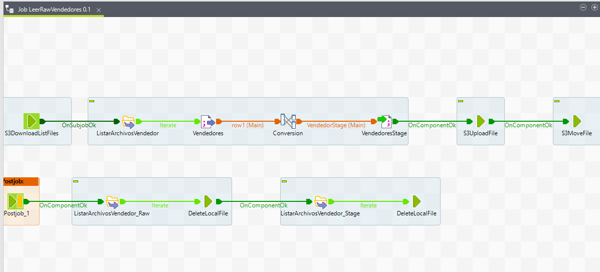

# **Jobs FromRawToStage**

Son los Jobs que realizan las transformaciones necesarias de los datos pasandolos a la Zona Stage en Amazon S3

## **1. Job LeerRawArticulo**

## **2. Job LeerRawBodega**

## **3. Job LeerRawClientes**

## **4. Job LeerRawCobradores**

## **5. Job LeerRawFacturaLinea**

## **6. Job LeerRawProveedores**

## **7. Job LeerRawVendedores**

---
[Anterior](FromDBToRaw.md)

[Siguiente](FromStageToPPT.md)

[Regresar a pagina principal](../README.md)