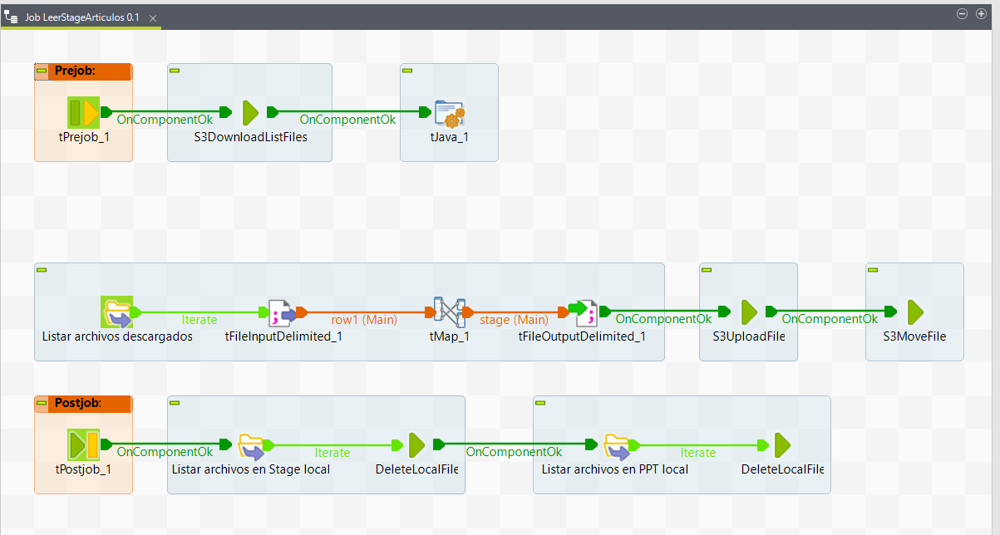
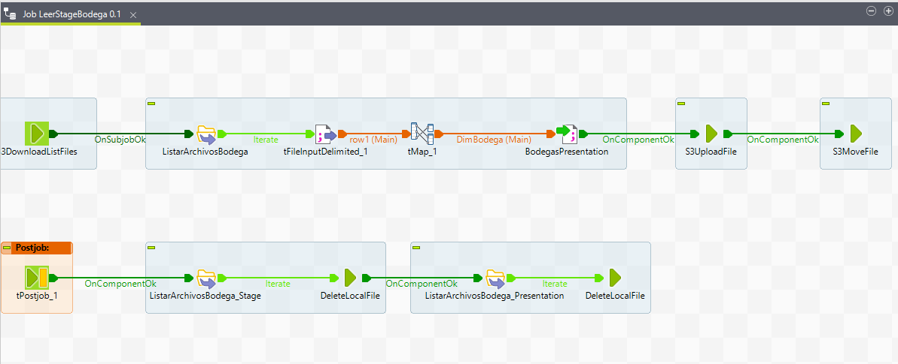
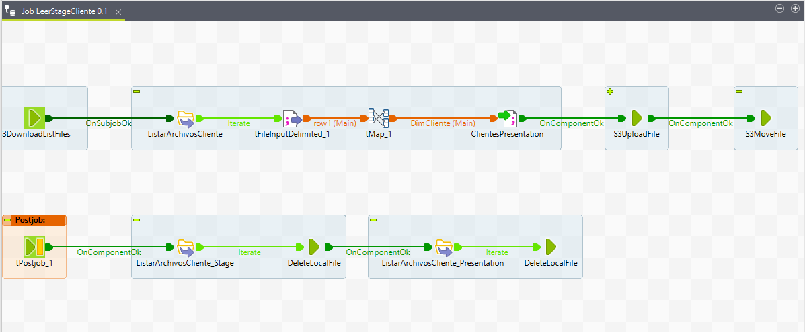
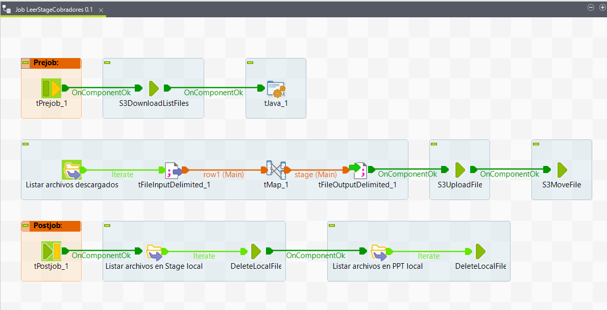
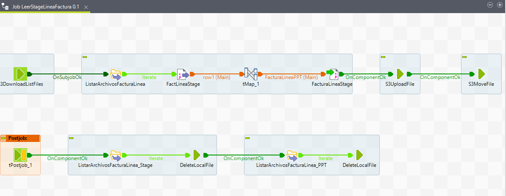
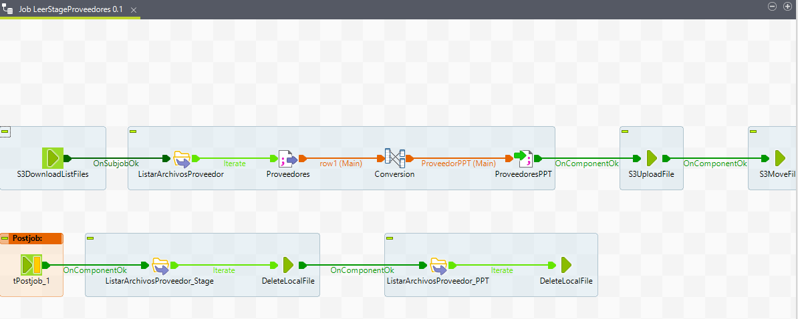
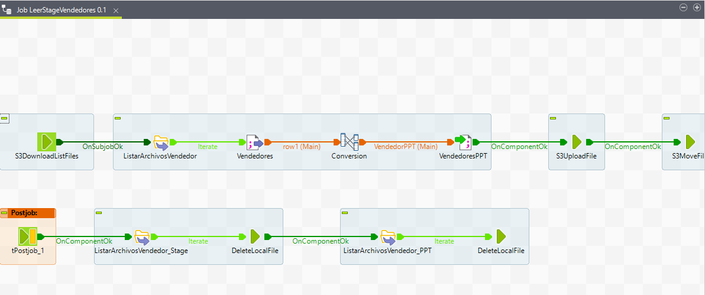

# **Jobs FromStageToPresentation**

Son los Jobs que realizan las transformaciones necesarias de los datos pasandolos a la Zona Presentation en Amazon S3

## **1. Job LeerStageArticulo**

## **2. Job LeerStageBodega**

## **3. Job LeerStageClientes**

## **4. Job LeerStageCobradores**

## **5. Job LeerStageFacturaLinea**

## **6. Job LeerStageProveedores**

## **7. Job LeerStageVendedores**

---
[Anterior](FromRawToStage.md)

[Siguiente](FromPresentationToRedshift.md)

[Regresar a pagina principal](../README.md)