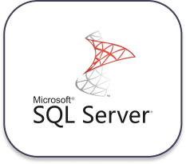
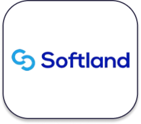
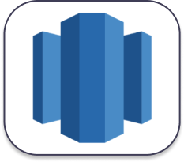
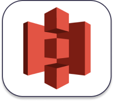
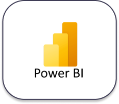

# **Herramientas utilizadas para la construcción de la solución**

## **Microsoft SQL Server**

> Microsoft SQL Server es un sistema de gestión de base de datos relacional, desarrollado por la empresa Microsoft. El lenguaje de desarrollo utilizado es Transact-SQL, una implementación del estándar ANSI del lenguaje SQL, utilizado para manipular y recuperar datos, crear tablas y definir relaciones entre ellas.

## **Softland**

>Es un completo Sistema de Gestión para Pymes que permite realizar una contabilidad, gestión comercial y pago de remuneraciones de manera eficiente y controlada. Se desarrolla mediante una línea de productos de gestión para Pymes, orientado especialmente a cubrir las necesidades totales de la empresa del siglo XXI.

## **Talend OpenStudio**

>Talend Open Studio (TOS) es una suite que aporta un conjunto muy complejo, variado y completo de herramientas para llevar a cabo la integración de datos que se ofrece en una versión de código libre (open source). Precisamente por ello, esta es una de las herramientas de integración ETL (extract, transform, load) más utilizadas dentro del mundo Big Data; es más, es la cuarta en la lista después de Informática Powercenter, IBM InfoSphere Datastage y Oracle Data Integrator (ODI).

## **Amazon Web Services (AWS)**

> Amazon Web Services (AWS) es la plataforma en la nube más adoptada y completa en el mundo, que ofrece más de 200 servicios integrales de centros de datos a nivel global. Millones de clientes, incluso las empresas emergentes que crecen más rápido, las compañías más grandes y los organismos gubernamentales líderes, están usando AWS para reducir los costos, aumentar su agilidad e innovar de forma más rápida.

## **Amazon Redshift**

>AWS Redshift es un almacén de datos rápido y completamente administrado que permite analizar todos los datos empleando de forma sencilla y rentable SQL estándar y las herramientas de inteligencia empresarial (BI) existentes. Esta herramienta ofrece la oportunidad de ejecutar consultas analíticas complejas en petabytes de datos estructurados, utilizando una sofisticada optimización de consultas, almacenamiento en columnas en discos locales de alto desempeño y ejecución masiva de consultas paralelas. La mayoría de los resultados se producen en segundos. 

## **Amazon S3**

>Amazon Simple Storage Service (Amazon S3) es un servicio de almacenamiento de objetos que ofrece escalabilidad, disponibilidad de datos, seguridad y rendimiento líderes en el sector. Clientes de todos los tamaños y sectores pueden almacenar y proteger cualquier cantidad de datos para prácticamente cualquier caso de uso, como los lagos de datos, las aplicaciones nativas en la nube y las aplicaciones móviles. Gracias a las clases de almacenamiento rentables y a las características de administración fáciles de usar, es posible optimizar los costos, organizar los datos y configurar controles de acceso detallados para cumplir con requisitos empresariales, organizacionales y de conformidad específicos.

## **PowerBI**

>Power BI es un conjunto de herramientas de análisis empresarial que pone el conocimiento al alcance de toda la organización. Power BI, como solución integrada en Office 365, permite la conexión a cientos de orígenes de datos, la preparación de datos simplificada, generación de análisis ad hoc. Además, esta herramienta de Business Intelligence permite dar vida a tus datos con los paneles e informes dinámicos
---

[Anterior](ScriptBaseDW.md)

[Regresar a pagina principal](../README.md)