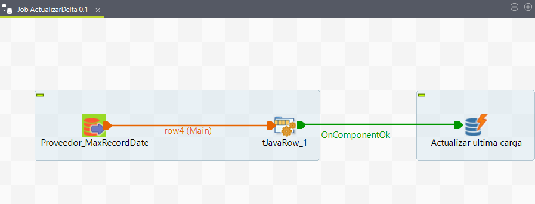
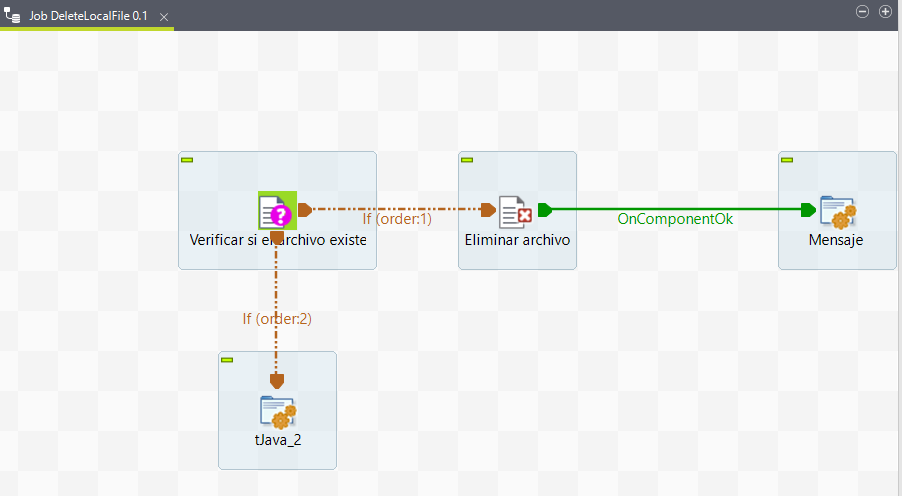
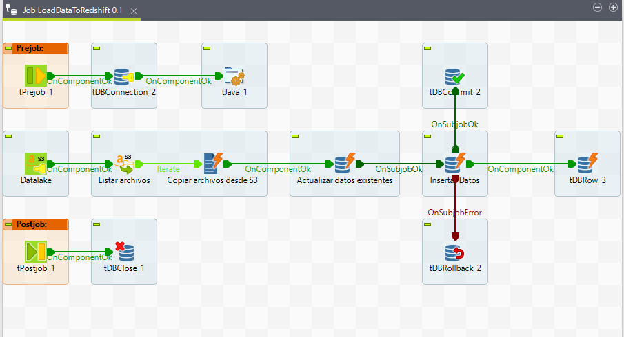
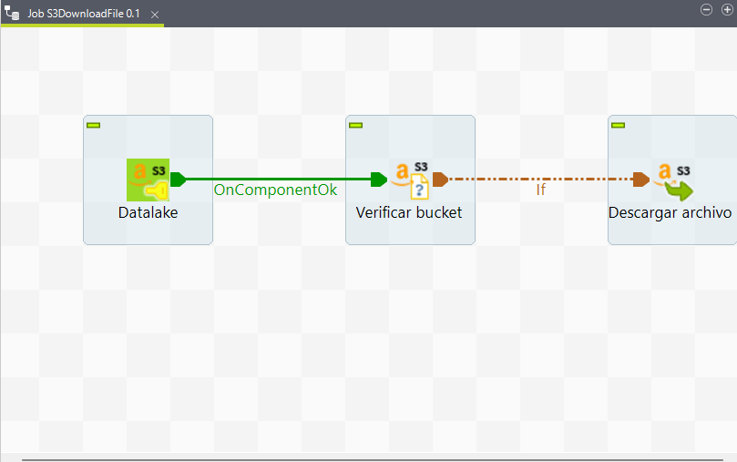
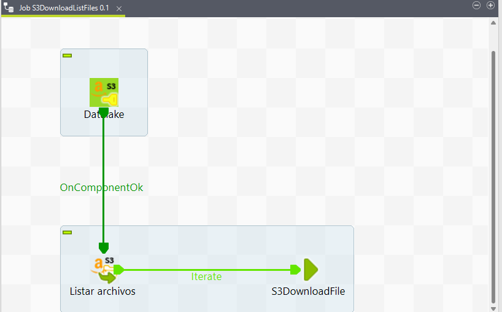
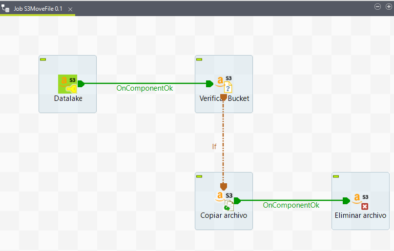
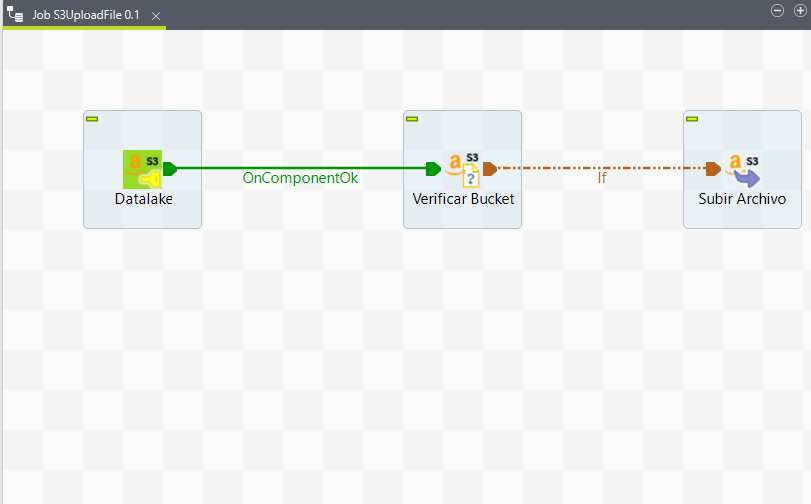

# **Jobs Common**

Son los Jobs comunes en todo el proceso, el cual para la reutilización y mejor gestión de los procesos se muestran los siguientes

## **1. Job ActualizarDelta**

## **2. Job DeleteToLocalFile**

## **3. Job LoadDataToRedshift**

## **4. Job S3DownloadFile**

## **5. Job S3DownloadListFiles**

## **6. Job S3MoveFile**

## **7. Job S3UploadFile**

---
[Anterior](Construccion.md)

[Siguiente](FromDBToRaw.md)

[Regresar a pagina principal](../README.md)