# **Mapping de modelo dimensional y tablas del dataset**

### **1. DimCliente**
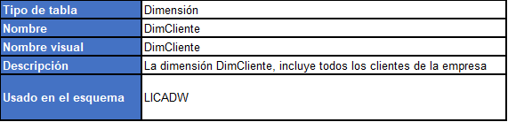
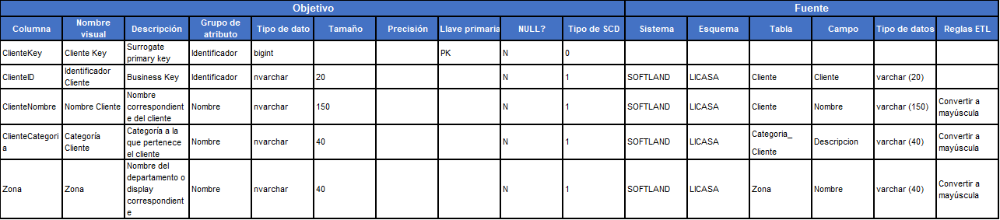

### **2. DimBodega**
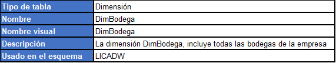
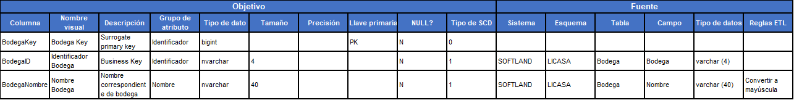

### **3. DimCobrador**

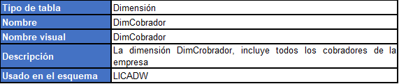

### **4. DimProveedor**
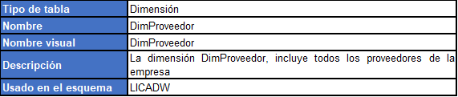
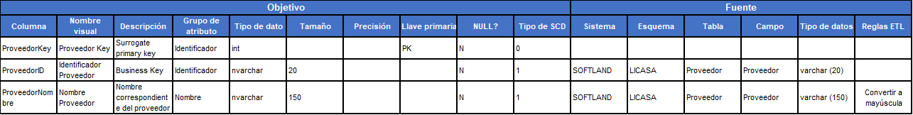

### **5. DimVendedor**

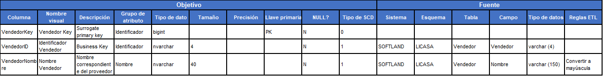

### **6. DimFecha**
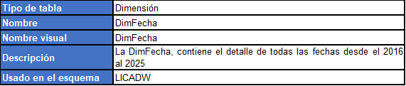
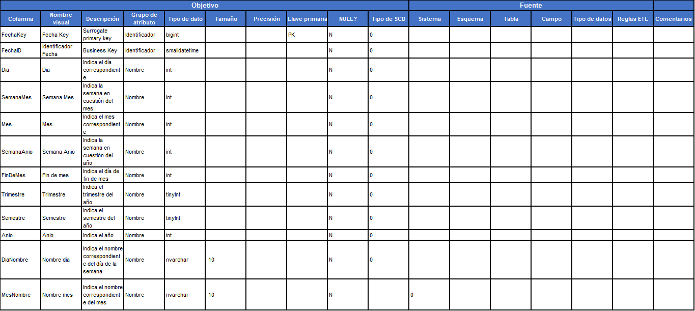

### **7. DimArticulo**
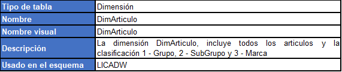
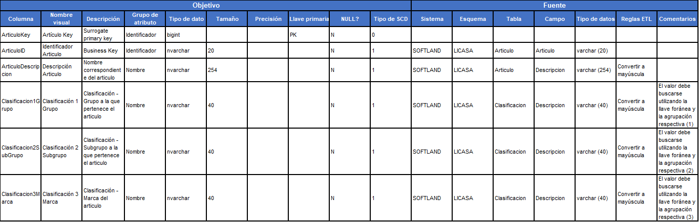

### **FactVentas**
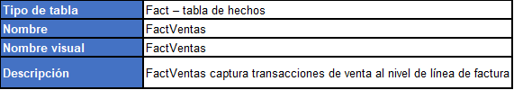

---
[Anterior](ModeloDimensional.md)

[Siguiente]()

[Regresar a pagina principal](../README.md)