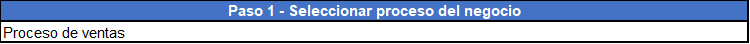
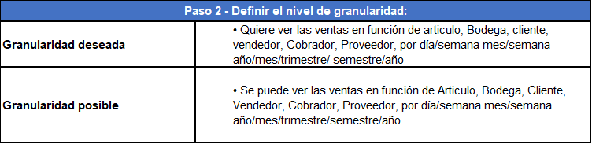
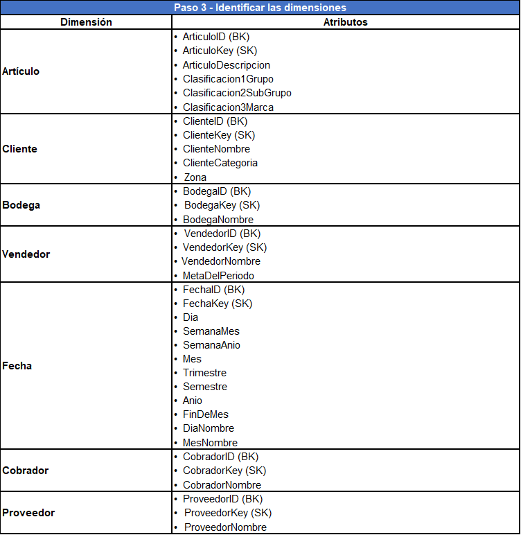
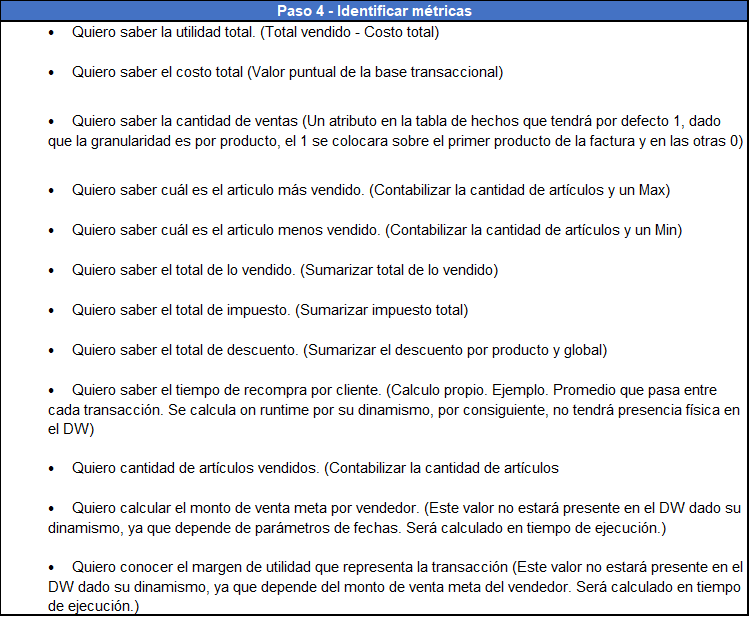
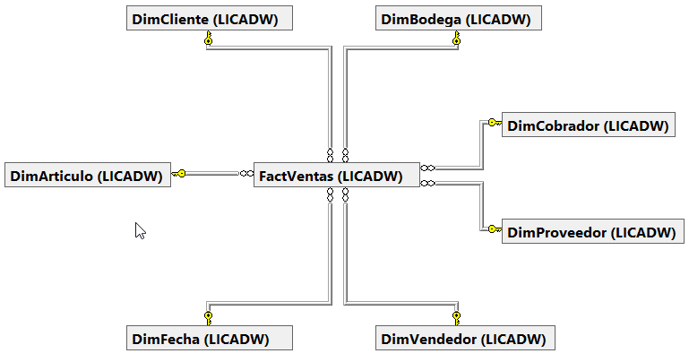
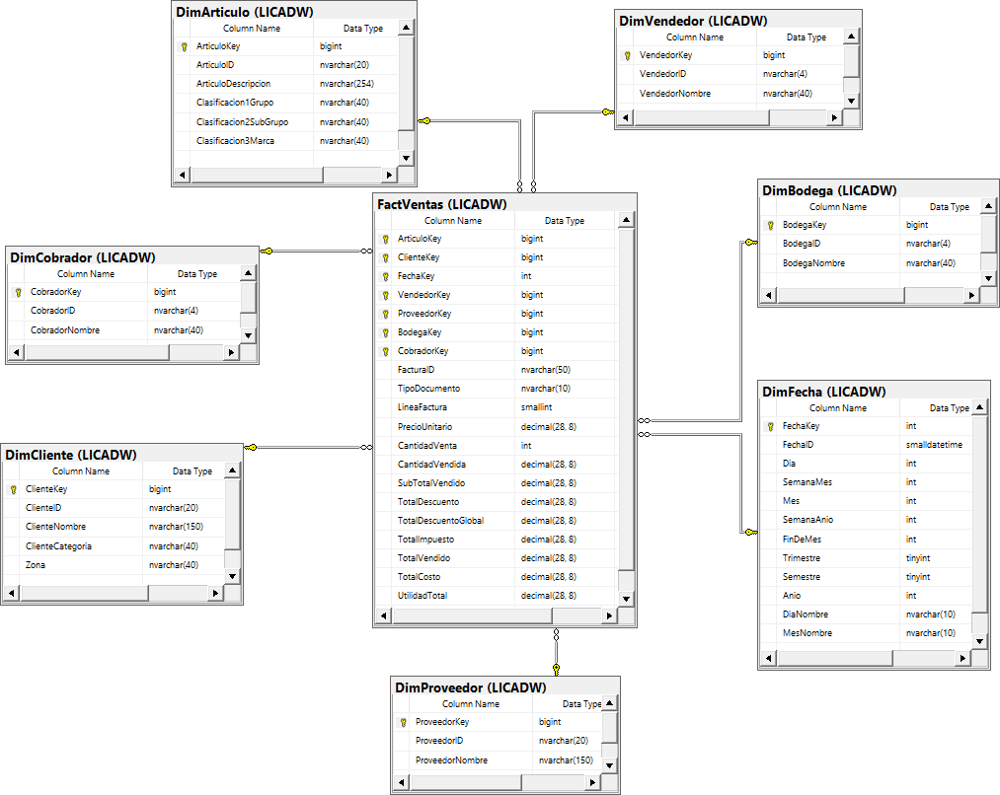

# **Modelo dimensional**

### **Paso 1. Seleccionar proceso del negocio**

### **Paso 2. Definir el nivel de granularidad**

### **Paso 3. Identificar las dimensiones**

### **Paso 4. Identificar metricas**

## **Diagrama ER del LICADW del oproceso de venta**

---
[Anterior](EspecificacionNecesidadesAnaliticas.md)

[Siguiente](MappingModeloDimensional.md)

[Regresar a pagina principal](../README.md)