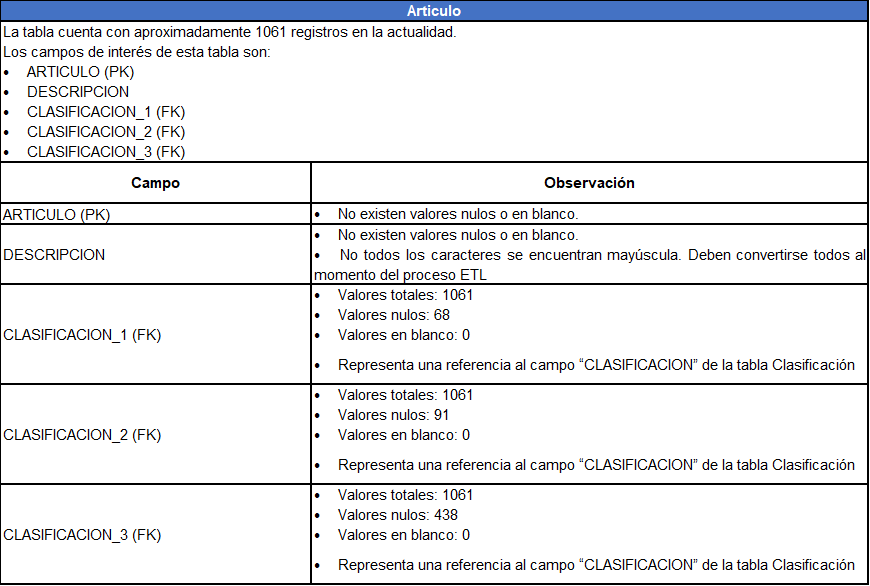
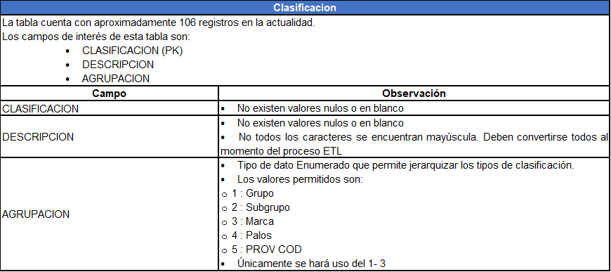
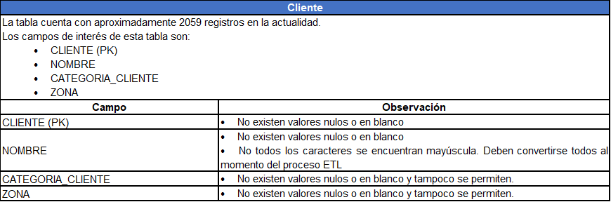
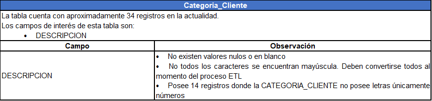
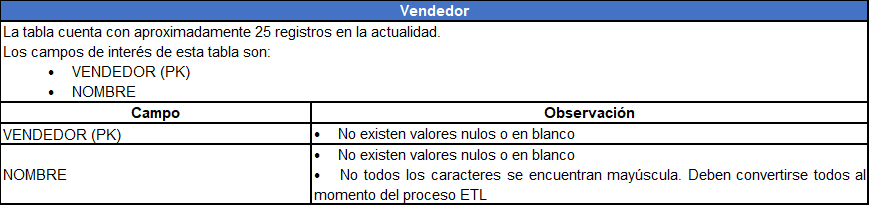
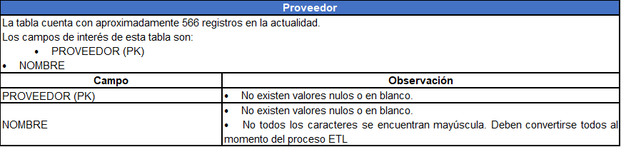
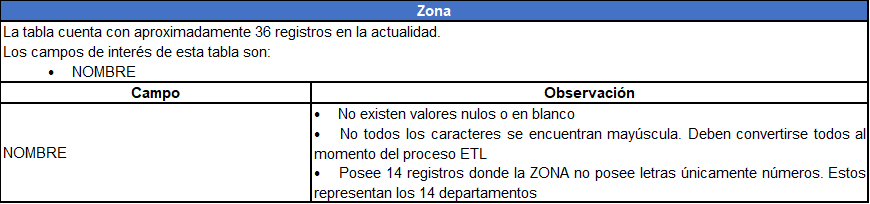
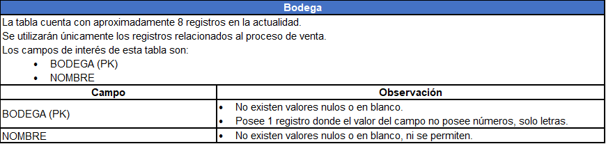
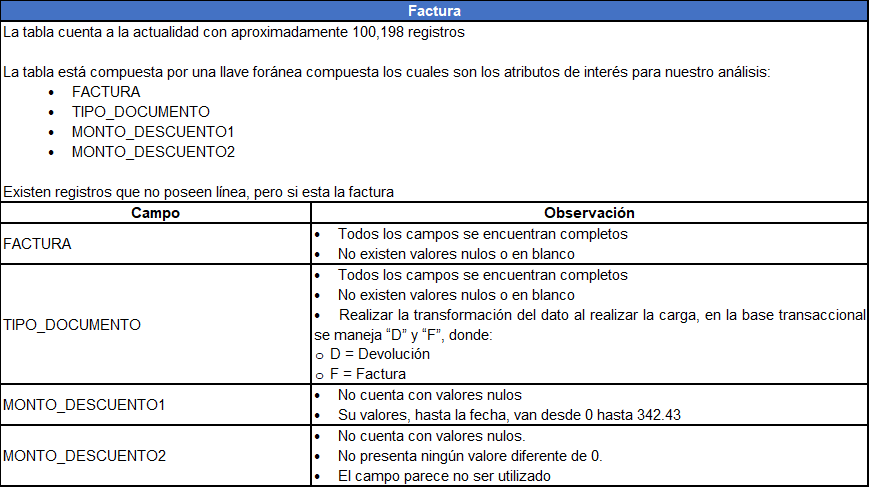
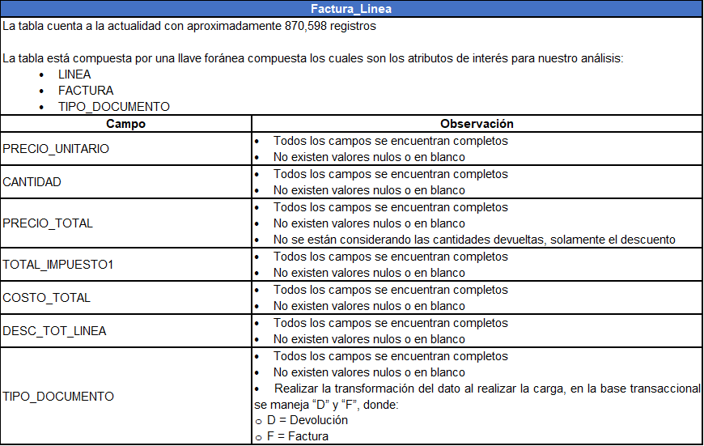

# **Resultados del data profiling**
En lo que respecta al análisis del data set y el perfilamiento los valores almacenados en cada tabla que lo conforma, se realizaron los siguientes hallazgos:

### **1. Articulo**

### **2. Clasificación**

### **3. Cliente**

### **4. Categoria_Cliente**

### **5. Vendedor**

### **6. Proveedor**

### **7. Cobrador**

### **8. Zona**

### **9. Bodega**

### **10. Factura**

### **11. Factura_Linea**

---
[Anterior](DescripcionDataSet.md)

[Siguiente](EspecificacionNecesidadesAnaliticas.md)

[Regresar a pagina principal](../README.md)