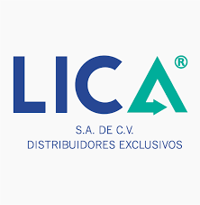

# **Análisis del proceso de ventas para la empresa "LICA S.A DE C.V"** 
El objetivo del presente proyecto es brindar una solución a nivel de Data Warehouse, apoyando a los procesos de análisis y toma de desiciones de la empresa LICA S.A DE C.V. Dicha empresa esta dedicada a la comercialización de articulos varios a clientes minoristas y mayoristas.

Para ello se detalla un análisis y construcción de un Datawarehouse así como tambien la representación a nivel de reportes finales, utilizando herramientas como Talend Open Studio, Amazon Redshift, Amazon S3, SQL Server, Power BI.

## **Tabla de contenido**
1. [Objetivos](FilesReadme/Objetivos.md)

2. [Introducción a la lógica del negocio](FilesReadme/IntroduccionLogicaNegocio.md)

3. [Descripción del Data Set y diccionario de datos](FilesReadme/DescripcionDataSet.md)

4. [Resultados del data profiling](FilesReadme/ResultadosDataProfiling.md)

5. [Especificación de necesidades analíticas que el modelo dimensional propuesto solventará](FilesReadme/EspecificacionNecesidadesAnaliticas.md)

6. [Modelo dimensional](FilesReadme/ModeloDimensional.md)

7. [Mapping de modelo dimensional y tablas del dataset](FilesReadme/MappingModeloDimensional.md)

8. [Script de la base de datos del DW](FilesReadme/ScriptBaseDW.md)

9. [Herramientas utilizadas](FilesReadme/HerramientasUtilizadas.md)

10. [Construcción](FilesReadme/Construccion.md)

11. [Resultados](FilesReadme/Resultados.md)
---
## Instituciones

