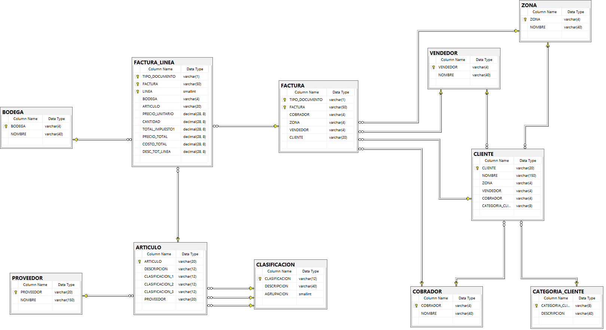

# **Análisis del proceso de ventas para la empresa "LICA S.A DE C.V"** 
El objetivo del presente proyecto es brindar una solución a nivel de Data Warehouse, apoyando a los procesos de análisis y toma de desiciones de la empresa LICA S.A DE C.V. Dicha empresa esta dedicada a la comercialización de articulos varios a clientes minoristas y mayoristas.

Para ello se detalla un análisis y construcción de un Datawarehouse así como tambien la representación a nivel de reportes finales, utilizando herramientas como Talend Open Studio, Amazon Redshift, Amazon S3, SQL Server, Power BI.

## **Tabla de contenido**
1. [Información general](#i)
2. [Technologies](#t)
3. [Installation](#)
4. [Collaboration](#)
5. [FAQs](#f)


## **Objetivos**

### **Objetivo General**
Diseñar un modelo multidimensional de Data Warehouse que soporte el análisis del proceso de ventas de la empresa “LICA S.A. de C.V.” que utiliza el software ERP Softland.

### **Objetivos Especificos**

- Describir el funcionamiento del proceso de ventas de la empresa en el ERP Softland.
- Realizar un perfilado de los datos que dispone la empresa para su proceso de ventas.
- Describir el dataset involucrado en el proceso de ventas y detallar sus metadatos.
- Determinar las necesidades analíticas del proceso de ventas que se pretende solventar con el modelo multidimensional.
- Crear un modelo multidimensional que solvente las necesidades analíticas del proceso de ventas.
- Elaborar un mapeo sobre el modelo multidimensional propuesto y el dataset del sistema transaccional Softland involucrado en el proceso de ventas.

## **Introducción a la lógica del negocio**

Las transacciones de ventas al sistema inician mediante pedidos, lo cuales pueden ser ingresados por un vendedor o por un validador (persona encargada de verificar el pedido y aprobar dicho pedido). Aunque el sistema permite la gestión de cotizaciones, la institución no hace uso de esa función en el sistema, sino que, proceden directamente a la gestión de los pedidos.

Durante la creación del pedido al asignarle el cliente al pedido, el usuario debe seleccionar el valor consecutivo que se le agregara al documento, pudiendo ser de tipo Factura de consumidor final o Crédito fiscal. Esta selección afectara los valores impreso en la factura. Si fuese crédito fiscal, al subtotal debe restársele un 1% de la venta neta, además de detallarse el valor del IVA de la venta. Caso, contrario solo se muestro los totales sin mayor detalle.

Una vez los pedidos han sido creados, estos son revisados por un validador, el cual es responsable de verificar, a través del ER, si se cuenta con el inventario suficiente en la bodega para cada uno de los productos que requiere el cliente. No se realizan pedidos parciales, la institución entrega la cantidad solicitada del producto o no lo entrega. En caso de no contar con la cantidad suficiente para surtir el pedido, el sistema permite la eliminación de las líneas del pedido cuyo inventario no es mayor o igual a lo solicitado. Cabe mencionar, que la institución únicamente hace uso de dos bodegas: General y Averías. Sus articulos sólo son despachados desde la bodega general, es por ello que, otro paso dentro de la validación es cerciorarse que los articulos serán tomados de la bodega correcta, previo a validar el inventario. Adicionalmente, en esta fase inicial, en la cual los pedidos están identificados con el estado de ‘Normal’, el ER permite aplicar descuentos sobre cada producto y de forma global a todo el pedido, si así se requiere. Otro paso que el validador debe realizar es asignarle un cobrador al pedido con base a la ruta configurada en el cliente, el cual es copiada al pedido, y una hoja de ruta que maneja la institución internamente donde detalla que ruta tendrá cada cobrador diariamente. Posterior a la verificación, el validador ‘Aprueba’ el pedido, cuando esto sucede, el ER cambia el estado del pedido de ‘Normal’ a ‘Aprobado’.

Debe mencionarse que el sistema permite la reserva de inventario para cada pedido en estado ‘Normal’ o ‘Aprobado’, esto causa que el inventario del producto en la bodega seleccionada se vea reducido cuando se consulta. Sin embargo, esta función no es utilizada por el cliente, lo que causa que el ER actualice el valor del inventario hasta que el pedido ha llegado a su fase final; es decir, ha sido facturado.

Cuando a un pedido se le ha aplicado descuentos por producto y, además, un descuento global, el sistema totaliza las líneas del pedido (total mercadería), dicho total ya ha sido afectado por el descuento por producto, sobre ese total mercadería se aplica el descuento global, el cual se maneja mediante porcentaje. El sistema no permite agregar el monto directamente.

Luego de que el pedido ha sido aprobado, pasa al departamento de facturación. Este departamento realiza una revisión muy parecida a la del validador para verificar que no se le haya escapado ningún detalle. En caso, de alguna inconsistencia, el departamento desaprueba el pedido, a lo cual el sistema reacciona actualizando el pedido a estado ‘Normal’. Si todo está en orden, el departamento utiliza la función de ‘Generar factura/Boleta’. Esta acción desencadena un proceso que realiza la creación de los registros en la base de datos en las tablas que almacenan la información del encabezado de la factura y sus líneas y se imprime el documento. Vale mencionar que una vez impresa la factura no se puede volver a imprimir el documento, de ser necesario se efectúa una refacturación; es decir, realizar todo el proceso nuevamente. A continuación, un diagrama BPMN del proceso que la institución lleva acabo en el sistema.


## **Descripción del Data Set y diccionario de datos**

Para la solución del proceso de ventas de la empresa se han identificado un conjunto de tablas del sistema transaccional que serán utilizadas como fuente de datos para el Data Warehouse, estas tablas serán conocidas como el ‘Data Set’, todas las tablas pertenecen al mismo esquema de la base de datos (SQL Server). Esquema: LICASA. Las tablas identificadas son las siguientes:



---
### **1. Artículo**
Almacena los productos que la empresa utiliza para su proceso de ventas y para uso interno de sus operaciones.


**Indices**


**Referencias:**

LICASA.CLASIFICACION (CLASIFICACION_1 => CLASIFICACION)

LICASA.CLASIFICACION (CLASIFICACION_2 => CLASIFICACION)

LICASA.CLASIFICACION (CLASIFICACION_3 => CLASIFICACION)

LICASA.PROVEEDOR (PROVEEDOR)

**Referenciada por:**

LICASA.FACTURA_LINEA (ARTICULO)

---
### **2. Clasificación**
Guarda los valores del catálogo que se utiliza para clasificar los artículos de la empresa. 


**Indices**


**Referenciada por:**

LICASA.ARTICULO (CLASIFICACION_1 -> CLASIFICACION)

LICASA.ARTICULO (CLASIFICACION_2 -> CLASIFICACION)

LICASA.ARTICULO (CLASIFICACION_3 -> CLASIFICACION)

---
### **3. Cliente**
Almacena a todas las personas naturales y jurídicas que forman parte de la cartera de clientes de la empresa.


**Indices**


**Referencias:**

LICASA.CATEGORIA_CLIENTE (CATEGORIA_CLIENTE)

LICASA.COBRADOR (COBRADOR)

LICASA.VENDEDOR (VENDEDOR)

LICASA.ZONA (ZONA)

**Referenciada por:**

LICASA.FACTURA (CLIENTE)

LICASA.FACTURA (CLIENTE_CORPORAC -> CLIENTE)

---
### **4. Categoria_Cliente**
Almacena el catálogo que se utiliza para categorizar a los clientes.


**Indices**


**Referenciada por:**

LICASA.CLIENTE (CATEGORIA_CLIENTE)

---
### **5. Vendedor**
Guarda todos los vendedores con los que han trabajado en la empresa.


**Indices**


**Referenciada por:**

LICASA.CLIENTE (VENDEDOR)

LICASA.FACTURA (VENDEDOR)

---
### **6. Proveedor**
Almacena todos los proveedores con los que ha trabajado la empresa.


**Indices**


**Referenciada por:**

LICASA.ARTICULO (PROVEEDOR)

---
### **7. Cobrador**
Guarda los datos de los cobradores, internamente conocidos como motoristas, que han trabajado en la empresa.


**Indices**


**Referenciada por:**

LICASA.CLIENTE (COBRADOR)

LICASA.FACTURA (COBRADOR)

---
### **8. Zona**
Almacena el catálogo que permite a la empresa segregar a sus clientes de forma geográfica y/o por la empleada (display) encargada de promocionar sus productos en sus establecimientos.


**Indices**


**Referenciada por:**

LICASA.CLIENTE (ZONA)

LICASA.FACTURA (ZONA)

---
### **9. Bodega**
Guarda los datos de las bodegas utilizadas por la empresa como almacén de sus productos.


**Indices**


**Referenciada por:**

LICASA.FACTURA_LINEA (BODEGA)

---
### **10. Factura**
Guarda los datos relacionados al encabezado de una transacción de venta, también conocida como factura. 


**Indices**


**Referencias:**

LICASA.COBRADOR (COBRADOR)

LICASA.ZONA (ZONA)

LICASA.CLIENTE (CLIENTE)

LICASA.VENDEDOR (VENDEDOR)

---
### **11. Factura_Linea**
Almacena los datos detallados de una transacción de venta, el artículo, cantidades y otros detalles pertinentes a la transacción. 


**Indices**


**Referencias:**

LICASA.ARTICULO (ARTICULO)

LICASA.BODEGA (BODEGA)

LICASA.FACTURA (FACTURA, TIPO_DOCUMENTO)

---

## **Resultados del data profiling**
En lo que respecta al análisis del data set y el perfilamiento los valores almacenados en cada tabla que lo conforma, se realizaron los siguientes hallazgos:


### **1. Articulo**


### **2. Clasificación**


### **3. Cliente**


### **4. Categoria_Cliente**


### **5. Vendedor**


### **6. Proveedor**


### **7. Cobrador**


### **8. Zona**


### **9. Bodega**


### **10. Factura**


### **11. Factura_Linea**


## **Especificación de necesidades analíticas que el modelo dimensional propuesto solventará**

Mediante entrevistas con diferentes usuarios con conocimiento del negocio, funcionamiento de la herramienta ERP Softland e interesados en la solución del modelo de Data Warehouse, logramos identificar algunas necesidades analíticas con las que se pretende brindar un apoyo al proceso de análisis sobre la situación de la empresa en el tiempo desde la perspectiva de sus clientes y vendedores. Los usuarios manifestaron el interés de contar con dos reportes, los cuales se detallan a continuación:

### **Reporte de ventas:**

Informe donde se desea conocer valores montos totales sobre sus transacciones. En el desean conocer los siguientes valores:

- La utilidad total de las ventas
- El costo total de las ventas
- El total de lo vendido
- La cantidad de ventas hechas
- El total de artículos vendidos
- El total de impuesto de las ventas
- El total de descuento
- El producto más y menos vendido
- El tiempo de recompra de cada cliente

### **Reporte comparativo de ingresos y crecimiento entre periodos:**

Este informe busca brindar información acerca de incrementos en los montos vendidos para determinar si esos posibles incrementos en los ingresos generados se deben al aumento de precios por factores económicos externos, como la inflación, o a un crecimiento el número de articulos vendidos en los diferentes periodos. 

Lo que se busca mostrar son los montos vendidos y la cantidad de articulos vendidos por periodos iguales a un año para que los usuarios interesados puedan observar los valores y comparar si hay un aumento en los ingresos y si se debe a una mayor cantidad de articulos vendidos. Dado que la empresa vende todos sus productos de forma individual, la unidad de medida para cada uno es la misma: Unidad. 

### **Reporte de rendimiento de vendedores:**

El informe de rendimiento de los vendedores busca conocer la situación de la ventas que cada empleado genera para poder conocer el avance en el tiempo hacia la meta planteada por la empresa año con año y tambien para brindar incentivos a los empleados según su rendimiento. Lo que se desea conocer son el margen de utilidad que cada empleado aporta con relación a la meta establecida para cada uno. 

La meta del periodo se desea calcular como el promedio de lo vendido en los ultimos 6 meses por cada vendedor más el 20% de ese valor en relación al rango de fechas que se desea evaluar. Para, posteriormente, utilizar dicho valor y calcular el margen de utilidad que representa cada venta hecha en el periodo en cuestión. 

La fórmula a utilizar seria:

Margen=(TotalVendido/MetaDelPeriodo)×100 


## **Modelo dimensional**

### **Paso 1. Seleccionar proceso del negocio**


### **Paso 2. Definir el nivel de granularidad**


### **Paso 3. Identificar las dimensiones**


### **Paso 4. Identificar metricas**


## **Diagrama ER del LICADW del oproceso de venta**


## **Mapping de modelo dimensional y tablas del dataset**

### **1. DimCliente**


### **2. DimBodega**


### **3. DimCobrador**


### **4. DimProveedor**


### **5. DimVendedor**


### **6. DimFecha**


### **7. DimArticulo**


### **FactVentas**


## **Script de la base de datos del DW**
 
``` sql

/*Creacion del DW*/
CREATE DATABASE "dwventaslica" WITH
OWNER licauser
CONNECTION LIMIT 3
COLLATE CASE_SENSITIVE
ISOLATION LEVEL SERIALIZABLE;

/*Creacion de Schema de configuracion -->*/
CREATE SCHEMA IF NOT EXISTS "configuracion" AUTHORIZATION licauser
QUOTA 2048 MB;

/*Creacion de objetos en el schema configuracion*/

/* Creacion de la tabla cargasdelta
Descripcion: Almacena la informacion de los deltas de la BD transaccional*/
CREATE TABLE "configuracion"."cargasdelta"
	("key"   VARCHAR(256) NOT NULL,
     "value" timestamp without time zone NOT NULL encode delta32k,
     CONSTRAINT cargasdelta_pkey PRIMARY KEY("key"),
	 CONSTRAINT cargasdelta_ukey UNIQUE("key"))
	 distkey("key") 
	 sortkey("key");
	 
/*Valores iniciales por tabla para configuración de Deltas*/
insert into "configuracion"."cargasdelta" values ('FACTURA_LINEA','1900-01-01 00:00:00.000');
insert into "configuracion"."cargasdelta" values ('COBRADOR','1900-01-01 00:00:00.000');
insert into "configuracion"."cargasdelta" values ('PROVEEDOR','1900-01-01 00:00:00.000');
insert into "configuracion"."cargasdelta" values ('BODEGA','1900-01-01 00:00:00.000');
insert into "configuracion"."cargasdelta" values ('CLIENTE','1900-01-01 00:00:00.000');
insert into "configuracion"."cargasdelta" values ('ARTICULO','1900-01-01 00:00:00.000');
insert into "configuracion"."cargasdelta" values ('VENDEDOR','1900-01-01 00:00:00.000');
/*<-- Fin insert*/

/*<-- Fin de creacion de schema configuracion*/

/*Creacion de schema licasa -->*/	 
CREATE SCHEMA IF NOT EXISTS "licasa" AUTHORIZATION licauser
QUOTA 5120 MB;

/*Creacion de los objetos en el schema licasa*/

/*Creacion de la tabla DimProveedor 
Descripcion: Almacena los registros de la dimension de Proveedor*/
CREATE TABLE "licasa"."dim_proveedor"
	("proveedor_key" BIGINT IDENTITY(1,1) NOT NULL encode az64,
	 "proveedor_id" VARCHAR(20) NOT NULL,
	 "proveedor_nombre" VARCHAR(150) NOT NULL,
	 CONSTRAINT dim_proveedor_pkey PRIMARY KEY ("proveedor_key"),
	 CONSTRAINT dim_proveedor_ukey UNIQUE ("proveedor_key"))
	 distkey("proveedor_key")
	 sortkey("proveedor_id");

/*Creacion de la tabla DimVendedor
Descripcion: Almacena los registros de la dimension de Vendedor*/
CREATE TABLE "licasa"."dim_vendedor"
	("vendedor_key" BIGINT IDENTITY(1,1) NOT NULL encode az64,
	 "vendedor_id" VARCHAR(20) NOT NULL,
	 "vendedor_nombre" VARCHAR(150) NOT NULL,
	 CONSTRAINT dim_vendedor_pkey PRIMARY KEY ("vendedor_key"),
	 CONSTRAINT dim_vendedor_ukey UNIQUE ("vendedor_key"))
	 distkey("vendedor_key")
	 sortkey("vendedor_id")
	 ;
	 
/*Creacion de la tabla DimArticulo
Descripcion: Almacena los registros de la dimension de Articulo*/
CREATE TABLE "licasa"."dim_articulo"
	("articulo_key" BIGINT IDENTITY(1,1) NOT NULL encode az64,
	 "articulo_id" VARCHAR(20) NOT NULL,
	"articulo_tipo" VARCHAR(20) NOT NULL,
	 "articulo_descripcion" VARCHAR(254) NOT NULL encode lzo,
	 "clasificacion1_grupo" VARCHAR(40) NOT NULL,
     "clasificacion2_subgrupo" VARCHAR(40) NOT NULL,
	 "clasificacion3_marca" VARCHAR(40) NOT NULL,
	 CONSTRAINT dim_articulo_pkey PRIMARY KEY ("articulo_key"),
	 CONSTRAINT dim_articulo_ukey UNIQUE ("articulo_key"))
	 distkey("articulo_key")
	 sortkey("articulo_id")
	 ;
	 
/*Creacion de la tabla DimBodega
Descripción: Tabla que almacena los registros correspondientes a la dimensión de Bodega*/
CREATE TABLE "licasa"."dim_bodega"
	("bodega_key" BIGINT NOT NULL IDENTITY (1,1) ENCODE az64,
	 "bodega_id" VARCHAR (4) NOT NULL,
	 "bodega_nombre" VARCHAR (40) NOT NULL,
	 CONSTRAINT dim_bodega_ukey UNIQUE ("bodega_key"),
	 CONSTRAINT dim_bodega_pkey PRIMARY KEY("bodega_key"))
	 distkey("bodega_key")
	 sortkey("bodega_id")
	 ;
	 
/*Creacion de la tabla DimCobrador
Descripción: Tabla que almacena los registros correspondientes a la dimensión de Cobrador*/
CREATE TABLE "licasa"."dim_cobrador"
	("cobrador_key" BIGINT NOT NULL IDENTITY (1,1) ENCODE az64,
	 "cobrador_id" VARCHAR (4) NOT NULL,
	 "cobrador_nombre" VARCHAR (40) NOT NULL,
	 CONSTRAINT dim_cobrador_ukey UNIQUE ("cobrador_key"),
	 CONSTRAINT dim_cobrador_pkey PRIMARY KEY("cobrador_key"))
	 distkey("cobrador_key")
	 sortkey("cobrador_id")
	 ;

/*Creacion de la tabla DimCliente
Descripción: Tabla que almacena los registros correspondientes a la dimensión de Cliente */
CREATE TABLE "licasa"."dim_cliente"
	("cliente_key" BIGINT NOT NULL IDENTITY (1,1) ENCODE az64,
	 "cliente_id" VARCHAR (20) NOT NULL,
	 "cliente_nombre" VARCHAR (150) NOT NULL,
	 "cliente_categoria" VARCHAR (40) NOT NULL,
	 "cliente_zona" VARCHAR (40) NOT NULL,
	 CONSTRAINT dim_cliente_ukey UNIQUE ("cliente_key"),
	 CONSTRAINT dim_cliente_pkey PRIMARY KEY("cliente_key"))
	 distkey("cliente_key")
	 sortkey("cliente_id")
	 ;
	 
/*Creacion de la tabla DimFecha
Descripción: Tabla que almacena los registros correspondientes a la dimensión de Fecha*/
CREATE TABLE "licasa"."dim_fecha"
	("fecha_key" BIGINT NOT NULL ENCODE az64,
	 "fecha_id" DATE NOT NULL ENCODE delta,
	 "dia" CHAR (2) NOT NULL,
	 "semana_mes" CHAR (2) NOT NULL,
	 "mes" CHAR (2) NOT NULL,
	 "semana_anio" CHAR (2) NOT NULL,
	 "fin_de_mes" CHAR (2) NOT NULL,
	 "trimestre" CHAR (1) NULL,
	 "semestre" CHAR (1) NOT NULL,
	 "anio" CHAR (4) NOT NULL,
	 "dia_nombre" VARCHAR (15) NOT NULL,
	 "mes_nombre" VARCHAR (15) NOT NULL,
	 CONSTRAINT dim_fecha_ukey UNIQUE ("fecha_key"),
	 CONSTRAINT dim_fecha_pkey PRIMARY KEY("fecha_key"))
	 distkey("fecha_key")
	 sortkey("fecha_id")
	 ;


/*Creacion de la tabla FactVentas
Descripción: Tabla que almacena los registros correspondientes a la tabla de hechos (fact) de Ventas*/
CREATE TABLE "licasa"."fact_ventas"
	("articulo_key" BIGINT NOT NULL,
	 "cliente_key" BIGINT NOT NULL,
	 "fecha_key" BIGINT NOT NULL,
	 "vendedor_key" BIGINT NOT NULL,
	 "proveedor_key" BIGINT NOT NULL,
	 "bodega_key" BIGINT NOT NULL,
	 "cobrador_key" BIGINT NOT NULL,
	 "factura_id" VARCHAR (50) NOT NULL,
	 "tipo_documento" VARCHAR (10) NOT NULL,
	 "linea_factura" smallint NOT NULL,
	 "precio_unitario" decimal (28,8) DEFAULT 0,
	 "cantidad_venta" integer DEFAULT 1,
	 "cantidad_vendida" decimal (28,8) DEFAULT 0,
	 "sub_total_vendido" decimal (28,8) DEFAULT 0,
	 "total_descuento" decimal (28,8) DEFAULT 0,
	 "total_descuento_global" decimal (28,8) DEFAULT 0,
	 "total_impuesto" decimal (28,8) DEFAULT 0,
	 "total_vendido" decimal (28,8) DEFAULT 0,
	 "total_costo" decimal (28,8) DEFAULT 0,
	 "utilidad_total" decimal (28,8) DEFAULT 0,
	 "anulada" VARCHAR (2) NOT NULL,
	 CONSTRAINT fact_ventas_pk PRIMARY KEY("articulo_key","cliente_key","fecha_key","vendedor_key","proveedor_key","bodega_key","cobrador_key"),
	 CONSTRAINT fact_ventas_uk UNIQUE ("articulo_key","cliente_key","fecha_key","vendedor_key","proveedor_key","bodega_key","cobrador_key"),
	 CONSTRAINT fact_ventas_facturaid_uk UNIQUE ("factura_id"))
	 distkey("factura_id")
	 sortkey("factura_id");


ALTER TABLE "licasa"."fact_ventas" ADD CONSTRAINT "dim_articulo_fk" FOREIGN KEY("articulo_key") REFERENCES "licasa"."dim_articulo"("articulo_key");

ALTER TABLE "licasa"."fact_ventas" ADD CONSTRAINT "dim_cliente_fk" FOREIGN KEY("cliente_key") REFERENCES "licasa"."dim_cliente"("cliente_key");

ALTER TABLE "licasa"."fact_ventas" ADD CONSTRAINT "dim_fecha_fk" FOREIGN KEY("fecha_key") REFERENCES "licasa"."dim_fecha"("fecha_key");

ALTER TABLE "licasa"."fact_ventas" ADD CONSTRAINT "dim_vendedor_fk" FOREIGN KEY("vendedor_key") REFERENCES "licasa"."dim_vendedor"("vendedor_key");

ALTER TABLE "licasa"."fact_ventas" ADD CONSTRAINT "dim_proveedor_fk" FOREIGN KEY("proveedor_key") REFERENCES "licasa"."dim_proveedor"("proveedor_key");

ALTER TABLE "licasa"."fact_ventas" ADD CONSTRAINT "dim_bodega_fk" FOREIGN KEY("bodega_key") REFERENCES "licasa"."dim_bodega"("bodega_key");

ALTER TABLE "licasa"."fact_ventas" ADD CONSTRAINT "dim_cobrador_fk" FOREIGN KEY("cobrador_key") REFERENCES "licasa"."dim_cobrador"("cobrador_key");


/*<-- Fin de creacion de schema licasa*/


